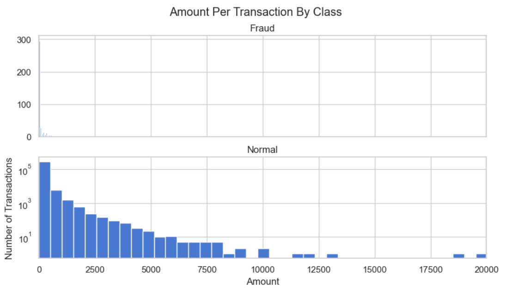
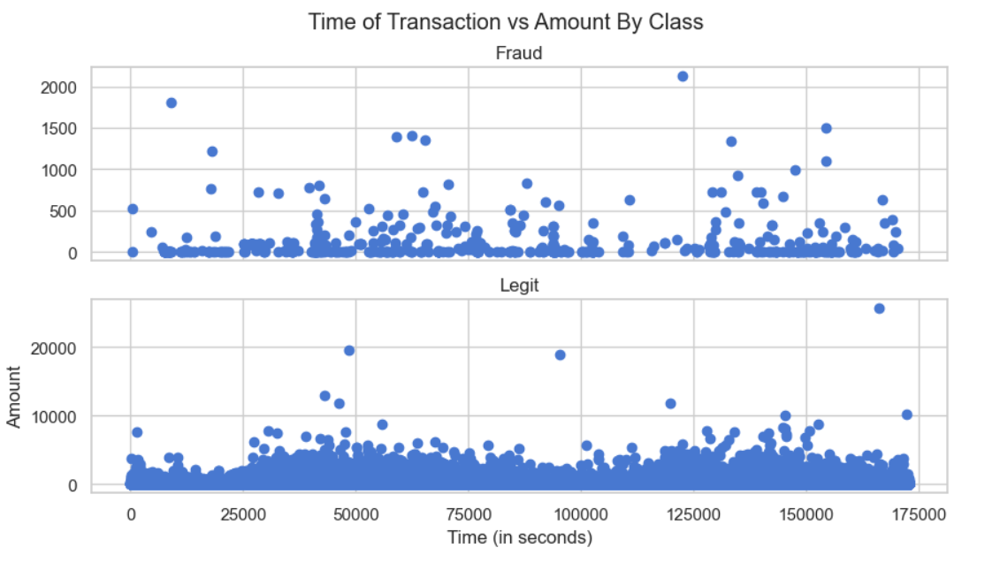
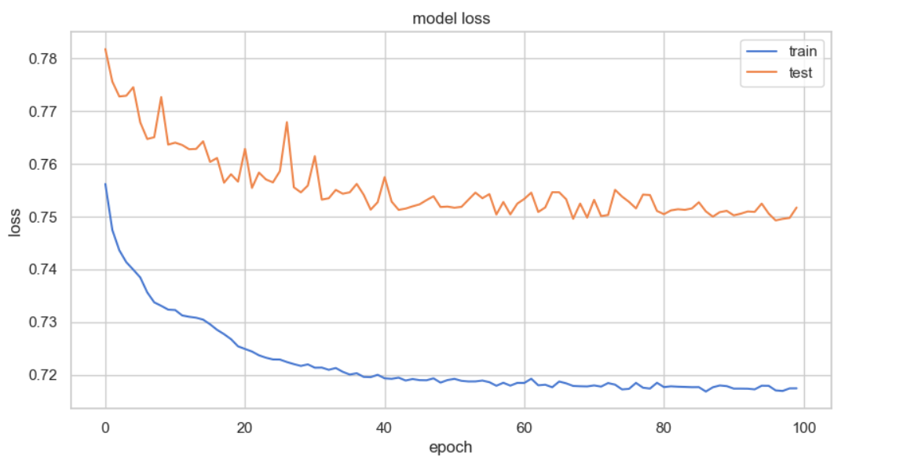
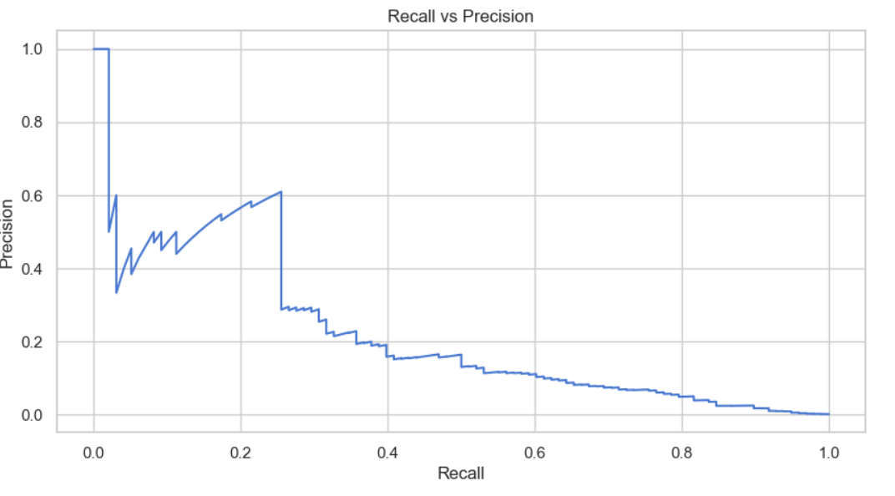
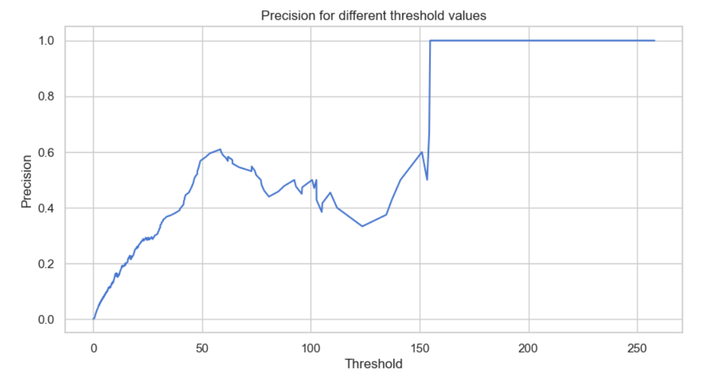
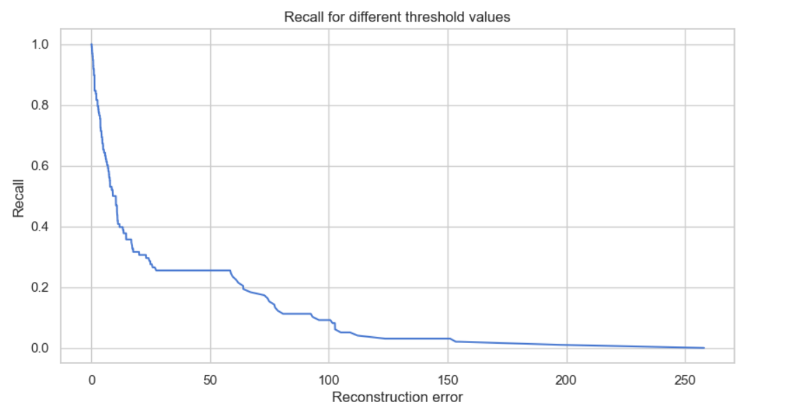
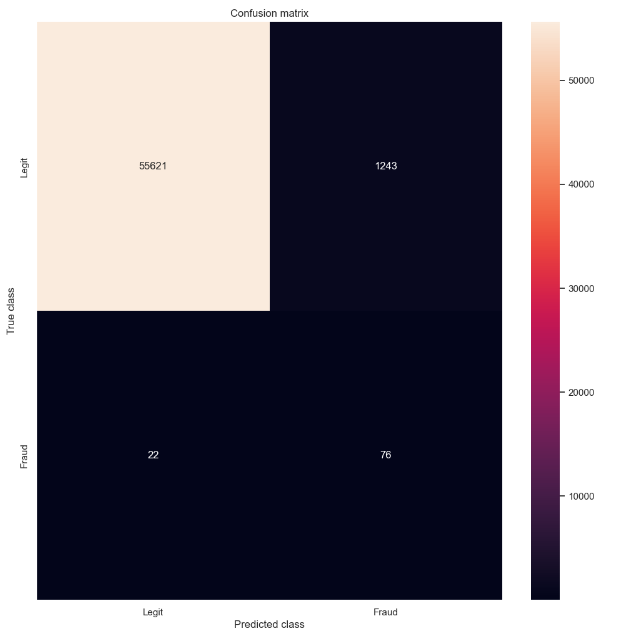

# FindDefault

A data science project to predict credit card transaction frauds using machine learning model.

## 1.0 Problem Statement

A credit card is one of the most used financial products to make online purchases and payments. Though the Credit cards can be a convenient way to manage your finances, they can also be risky. Credit card fraud is the unauthorized use of someone else's credit card or credit card information to make purchases or withdraw cash.
It is important that credit card companies are able to recognize fraudulent credit card transactions so that customers are not charged for items that they did not purchase. 

The dataset contains transactions made by credit cards in September 2013 by European cardholders. This dataset presents transactions that occurred in two days, where we have 492 frauds out of 284,807 transactions. The dataset is highly unbalanced, the positive class (frauds) account for 0.172% of all transactions.

We have to build a classification model to predict whether a transaction is fraudulent or not.

## 2.0 Implementation Strategy

**Exploratory Data Analysis:** Analyze and understand the data to identify patterns, relationships, and trends in the data by using Descriptive Statistics and Visualizations. 

**Data Preparation:** This might include standardization, handling the missing values and outliers in the data. 
Dealing with Imbalanced data: This data set is highly imbalanced. The data should be balanced using the appropriate methods before moving onto model building.

**Feature Engineering:** Transform the existing features for better performance of the ML Models. 

**Model Selection:** Choose the most appropriate model that can be used for this project. 

**Model Training:** Split the data into train & test sets and use the train set to estimate the best model parameters. 

**Model Evaluation:** Evaluate the performance of the model on data that was not used during the training process. The goal is to estimate the model's ability to generalize to new, unseen data and to identify any issues with the model, such as overfitting. 

**Model Deployment:** Model deployment is the process of making a trained machine learning model available for use in a production environment. 

## 3.0 Data Insights

This provided credit_card.csv dataset contains 492 frauds out of 284,807 transactions. 

The dataset is highly unbalanced, the positive class (frauds) account for 0.172% of all transactions.

*- Data has 31 features from V1-V28 & Time, Amount and Class
*- Input features: V1-V28, Time and Amount
*- Target variable: Class

* #### Transaction Distribution by class.

    **A** The percentage of fradulent transactions (0.172%) very less, thus we have an highly imbalanced dataset.

* #### Amount per transaction by class.

    **B** Amount of transactions between legit & fraud differs by a huge margin.

    
    
* #### Time of transaction vs amount by class

    **C** The fraud transactions seems to have amount not more than 2500.

    
    

## 4.0 Model Evaluation

We have used Keras Autoencoder to create a deep learning model by training it with 20% of dataset and loading the most optimized result to the data model.

#### Model Loss

   

#### Recall vs Precision
   
   
   
   
#### Precision for different threshold values
   
   
   
   
#### Recall for different threshold values
   
   

## 5.0 Model Prediction

In order to predict whether or not a new/unseen transaction is normal or fraudulent, we will calculate the reconstruction error from the transaction data itself. If the error is larger than a predefined threshold, we’ll mark it as a fraud (since our model should have a low error on normal transactions). We have picked a default value now for the threshold, that can be increased further as per requirements.

Threshold value: 3.1

#### Precision for different threshold values( Time of transaction vs Amount by Class)

   
   
#### Confusion Matrix

   

## 6.0 Conclusions

The data is extremaly unbalanced, however it was possible to make all the required analysis, prepare the data and create a highly accurate machine learning model with Keras. The model can now be used to predict the fraudulent & legitimate transactions from a given dataset.

